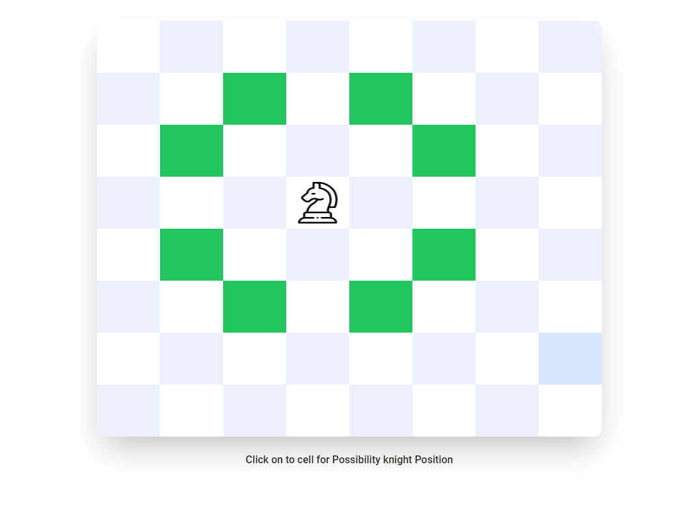
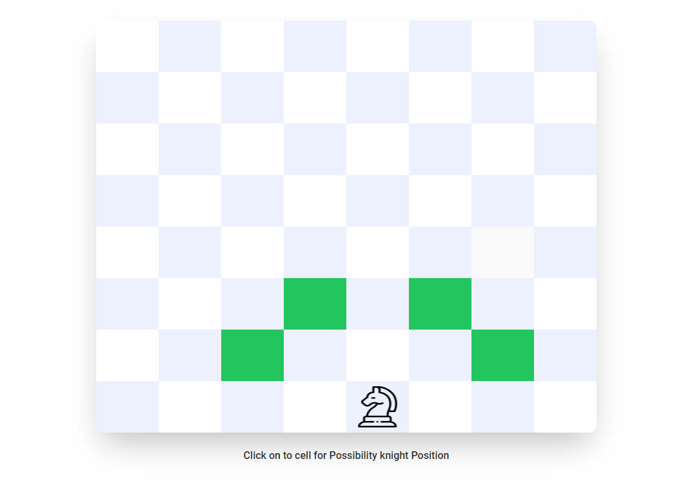

## Task: Find Chess Board all possible knight positions


### Live: https://chessboard-knight.netlify.app
### Code: https://github.com/rasel-mahmud-dev/chessboard-knight 


## Features
This application I create a function that take chess board size like 4*4 or 8*8 or 16*16... and it calculate all possible position where knight can be moved. 

## Technologies
- Typescript 
- ReactJS
- Jest (test)
- tailwindcss

## Explanation
Assume we have 8*8 board and our initial knight position is {x: 0, y: 0}
```ts
    const BOARD_SIZE = 8
    // this mat data
    const matData: number[][] = [
        [1, 0, 1, 0, 1, 0, 1, 0],
        [0, 1, 0, 1, 0, 1, 0, 1],
        [1, 0, 1, 0, 1, 0, 1, 0],
        [0, 1, 0, 1, 0, 1, 0, 1],
        [1, 0, 1, 0, 1, 0, 1, 0],
        [0, 1, 0, 1, 0, 1, 0, 1],
        [1, 0, 1, 0, 1, 0, 1, 0],
        [0, 1, 0, 1, 0, 1, 0, 1],
    ]
```
we know knight only move x or y axios forward two box then y and x axios one box .
So firstly, it moves for x: 0, y: 0  two possible place one = xIndex:2,yIndex:1 and another is yIndex:2, xIndex: 1


preview:



### Video
https://user-images.githubusercontent.com/99707905/213870417-d933720b-f4cd-4104-9c7d-b43d7f9a72f0.mp4